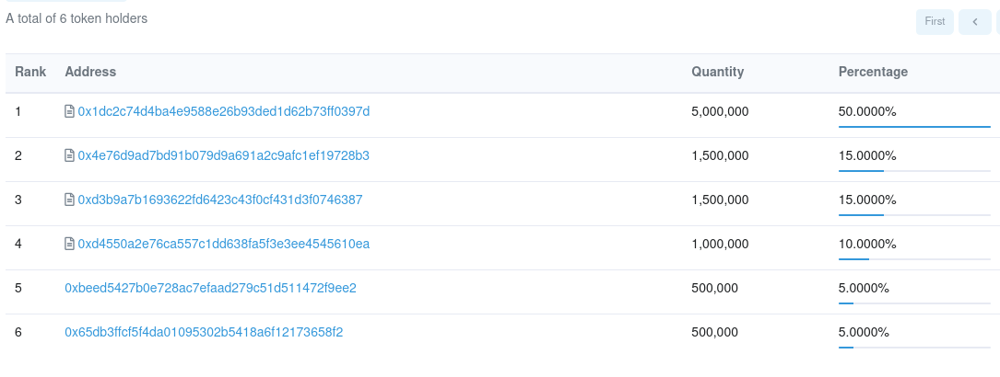

# 💰 Token Distribution

Token Information:

Name:ERC20 $M4Spore

Identifier: M4SPORE

Total Supply: 10,000,000

DECIMALS: 18

CONTRACT: [https://etherscan.io/address/0x34fee42698a94c7c6aa5ff674dcc26655ee9990c#code](https://etherscan.io/address/0x34fee42698a94c7c6aa5ff674dcc26655ee9990c#code)\
\
you will know this contract because it is linked eternally with the Utility pass contract on the AVAX network that has an IDENTICAL ADDRESS.

Burn Wallet:  unsold in Vested Sales rounds burned.  Dev tokens may be burned at discretion.

Staking/Liquidity 30% (3,000,000 M4Spore Tokens)

* Tokens reserved for Staking/liquidity pool
* now @eth:0x1dc2C74d4Ba4e9588e26B93Ded1D62B73fF0397d multisig

SPORE & M4Rabbit NFT HOLDER Rewards 20% (2,00,000 M4Spore Tokens)

* These tokens are only available to M$Rabbit NFT HOLDERS
* Prizes, give aways and other rewards, communi ty purchases etc
* now @ eth:[0x1dc2C74d4Ba4e9588e26B93Ded1D62B73fF0397d](https://gnosis-safe.io/app/eth:0x1dc2C74d4Ba4e9588e26B93Ded1D62B73fF0397d/balances) multisig&#x20;

Private Sale WL vesting 15% (1,500,000 M4Spore Tokens)

* offered in private to whitelisted persons & NFT holders - $0.05
* UNSOLD BURNED 10% released every 10 days
* now @[ eth:0xD3B9A7b1693622FD6423c43F0cf431d3F0746387](https://etherscan.io/address/0xd3b9a7b1693622fd6423c43f0cf431d3f0746387#writeContract) WhiteListed sales contract

Public Vesting 15% (1,500,000 M4Spore Tokens)

* offered in public to everyone - $0.10
* &#x20;UNSOLD BURNED 10% released every 7 days
* now @eth:[0x4e76d9ad7bd91b079d9a691a2c9afc1ef19728b3](https://etherscan.io/address/0x4e76d9ad7bd91b079d9a691a2c9afc1ef19728b3#code) Public open sales contract

\
Marketing Vested 10% (1,000,000 M4Spore Tokens)

* a specific wallet that will be used to run marketing and ad influencer campaigns to draw attention to project and gaming as they launch.&#x20;
* 5% released every 7 days

Dev/Treasury unlocked 10% (1,000,000 M4Spore Tokens)

* available straight away this is basically what is used by the team for rewards, incentives, giveaways, testing, development costs and to pay for other devs or new team members ad-hoc.

Between private holders, Burn and liquidity there are in total 60% (6 Million) of ALL Tokens

A further 20%  (2 Million) of Total Tokens can only be rewarded to M4 NFT Holders.

Of the remaining 20% (2 Million) HALF (1 Million) locked at 5% every 7 days and 10% (1 Million) unlocked.

TOKENS CAN BE CLAIMED FROM THE END OF THE EACH SALE AND TIME RESETS EACH CLAIM
